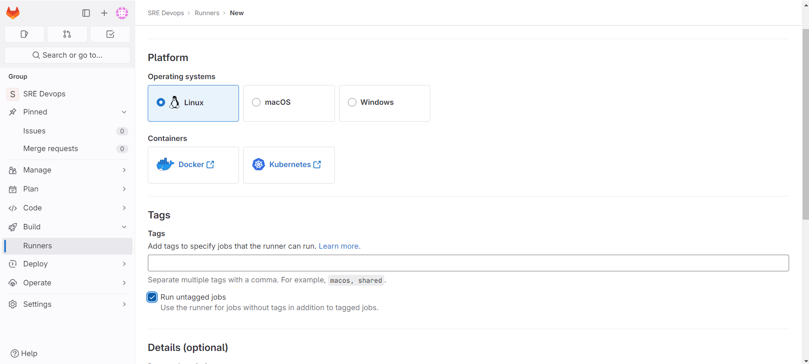
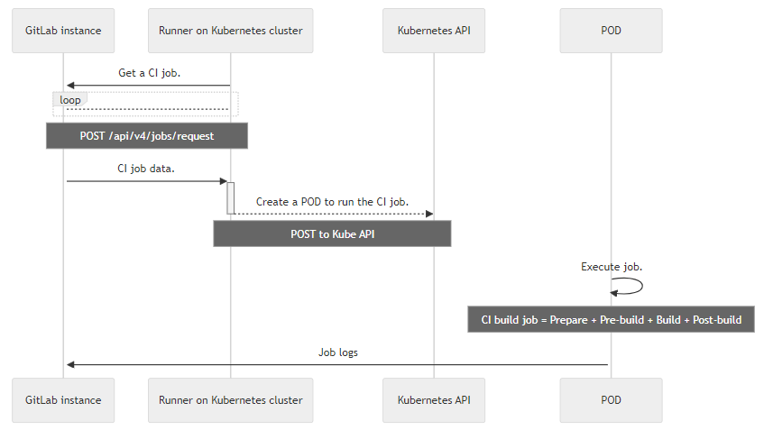

# 1. GitLab Runner + GitLab Runner Operator
## 1.1. Setup GitLab Runner on K8s with GitLab Runner Operator

**Step 1:** [Install Cert Manager on K8s's `cert-manager` namespace](../Kubernetes/CRDs/Cert-manager.md#^3bee9b).

**Step 2:** [Install Operator Lifecycle Manager - OLM to help manage the Operators running on K8s's `olm` namespace](../Kubernetes/CRDs/Operator%20Lifecycle%20Manager%20-%20OLM.md#^f56b44).

Then, install GitLab Runner Operator on K8s's `operators` namespace:

```shell
kubectl create -f https://operatorhub.io/install/gitlab-runner-operator.yaml
```

Verify that GitLab Runner Operator has been installed on K8s' `operators` namespace by checking Cluster Service Version:

```shell
kubectl get csv -n operators
```

**Step 3:** Create Runner Group on GitLab UI:



Create a K8s Secret to store authentication token obtained from the created Runner Group above:

```yaml
apiVersion: v1
kind: Secret
metadata:
  name: <GITLAB_RUNNER_NAME>
  namespace: <GITLAB_RUNNER_NAMESPACE>
stringData:
  runner-token: <GITLAB_RUNNER_GROUP_TOKEN>
```

^245206

Create a GitLab Runner from the following manifest:

```yaml
apiVersion: apps.gitlab.com/v1beta2
kind: Runner
metadata:
  name: <GITLAB_RUNNER_NAME>
  namespace: <GITLAB_RUNNER_NAMESPACE>
spec:
  gitlabUrl: <GITLAB_URL>
  
  # Read Runner Group authentication token stored in K8s Secret
  token: gitlab-runner-secret 
```
## 1.2. Customize GitLab Runner Configuration

To change the behavior of GitLab Runner and individual registered runners, modify the `config.toml` file.

Create a `config.toml` file:

```toml
concurrent = 20
check_interval = 5
log_level = "debug"
listen_address = "[::]:9252"

[[runners]]
  executor = "kubernetes"
  [runners.kubernetes]
    pull_policy = "if-not-present"
```

Use [K8s's Kustomize to generate ConfigMap from file](../Kubernetes/CRDs/Kustomize.md#^3db826):

```yaml
apiVersion: kustomize.config.k8s.io/v1beta1
kind: Kustomization
configMapGenerator:
  - name: <GITLAB_RUNNER_CUSTON_CONFIGMAP_NAME>
    files:
    - config.toml
generatorOptions:
  disableNameSuffixHash: true
```

The kustomization file must be in the same directory as `config.toml` and its structure like the following:

```console
| GitLab
| - config.toml
| - kustomization.yaml
| - ...
```

Create K8s's ConfigMap from `config.toml` file:

```bash
kubectl apply -k .
```

Add `config` property to the [Runner's manifest](#^245206):

```yaml
...
spec:
  gitlabUrl: <GITLAB_URL>
  token: gitlab-runner-secret
  config: <GITLAB_RUNNER_CUSTOM_CONFIGMAP_NAME>
```
## 1.3. How the K8s Executor Work

K8s Executor calls the K8s cluster API and creates a Pod for each GitLab CI Job:

- **Step 1 - Prepare:** K8s create the Pod which includes Containers required for the build and services to run.
- **Step 2 - Pre-build:** K8s uses a special Container in Pod to clone, restore cache, and download artifacts from previous stages.
- **Step 3 - Build:** GitLab Runner do build.
- **Step 4 - Post-build:** K8s uses the special Container again to create cache, upload artifacts to GitLab.



